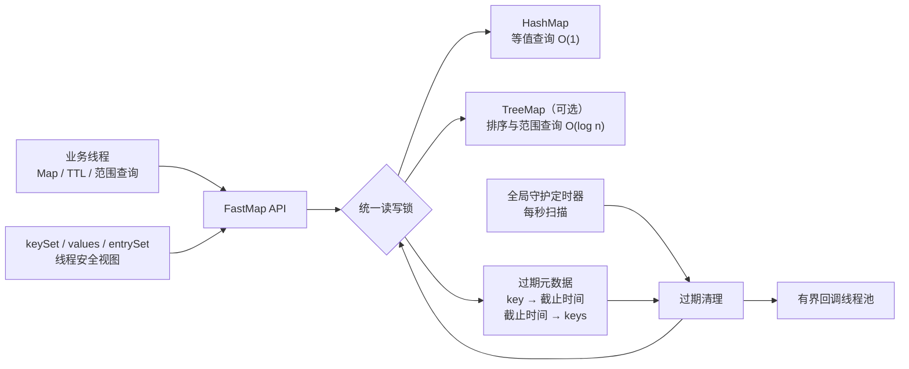

# FastMap

FastMap 是一个面向本地缓存场景的线程安全 `Map` 实现，在标准 `Map` 能力之上提供：

- 基于 `HashMap` 的等值查询
- 可选的键排序与范围查询
- 毫秒级 TTL 和自动过期
- 过期回调
- 原子化的 `compute`、`merge`、`putIfAbsent` 等复合操作
- 支持写回原 Map 的 `keySet()`、`values()` 和 `entrySet()` 视图

项目使用 Java 8 和 Maven。

## 为什么叫 FastMap？

FastMap 的核心思路是让不同类型的查询走各自更擅长的数据结构：

- 等值查询走 `HashMap`，平均时间复杂度为 `O(1)`
- 排序、首尾键和范围查询走 `TreeMap`，时间复杂度为 `O(log n)`

如果只使用 `TreeMap`，普通的 `get(key)` 也需要 `O(log n)`；FastMap 额外维护一份 `HashMap` 索引，让最常见的等值查询保持平均 `O(1)`，同时保留有序和范围查询能力。

这种设计本质上是用额外的内存和写入维护成本，换取多种查询场景下更快、更稳定的读取性能。因此这里的 “Fast” 主要指查询路径针对不同场景进行了优化，并不代表所有操作都无条件快于其他 Map 实现。

## 核心原理

FastMap 同时维护数据索引、排序索引和过期元数据，并使用同一把
`ReentrantReadWriteLock` 保证复合操作的原子一致性。



### 数据一致性

启用排序后，同一份数据会同时写入：

- `HashMap`：负责 `get()`、`containsKey()` 等等值查询
- `TreeMap`：负责 `firstKey()`、`subMap()` 等排序和范围查询

写入、删除、过期清理和批量更新都在统一写锁内执行。排序写入失败时不会留下只更新一个索引的中间状态。

### 过期机制

过期数据通过三种时机清理：

1. 调用查询方法时主动清理已经到期的数据
2. 后台守护线程每秒扫描一次
3. 设置过期回调时，在截止时间触发一次定向清理

重复调用 `expire()` 会重置 TTL，并取消旧的回调定时任务。回调由有界线程池执行，避免大量 key 同时过期时无限创建线程。

启用过期功能的 FastMap 实例通过弱引用注册到全局清理器，不会因为后台定时任务而永久无法被垃圾回收。

## 快速开始

```java
import com.hdwang.fastmap.FastMap;
import com.hdwang.fastmap.IFastMap;

public class Main {

    public static void main(String[] args) throws Exception {
        IFastMap<Long, String> map = new FastMap<>();

        map.put(1L, "张三");
        System.out.println(map.get(1L));

        // 2 秒后过期
        map.expire(1L, 2_000L);
        System.out.println("TTL: " + map.ttl(1L) + " ms");

        // 重置 TTL，并注册过期回调
        map.expire(1L, 3_000L,
                (key, value) -> System.out.println(
                        key + " 已过期，原值为 " + value));

        Thread.sleep(3_500L);
        System.out.println(map.get(1L)); // null
    }
}
```

## 排序与范围查询

### 使用 Key 的自然顺序

```java
IFastMap<Long, String> map = new FastMap<>(false, true);
map.put(3L, "王五");
map.put(1L, "张三");
map.put(2L, "李四");

System.out.println(map.firstKey());       // 1
System.out.println(map.lastKey());        // 3
System.out.println(map.subMap(1L, 3L));   // {1=张三, 2=李四}
System.out.println(map.headMap(3L));      // {1=张三, 2=李四}
System.out.println(map.tailMap(2L));      // {2=李四, 3=王五}
```

构造器的两个布尔参数依次表示：

```java
new FastMap<>(enableExpire, enableSort);
```

### 使用自定义 Comparator

```java
IFastMap<String, Integer> map =
        new FastMap<>(true, Comparator.reverseOrder());

map.put("Alice", 1);
map.put("Bob", 2);
```

`Comparator` 必须与 `equals()` 保持一致。如果比较器把两个不相等的 key 判断为相等，FastMap 会拒绝写入，避免 `HashMap` 和 `TreeMap` 对 key 的认知不一致。

## Map View 行为

`keySet()`、`values()` 和 `entrySet()` 返回的是由原 Map 支持的视图，不是独立副本。

```java
FastMap<Integer, String> map = new FastMap<>(false);
map.put(1, "A");
map.put(2, "B");

map.values().remove("A");       // 同时从 map 删除 key=1
map.keySet().remove(2);         // 同时从 map 删除 key=2
```

支持的写回操作包括：

- `view.remove(...)`
- `view.clear()`
- `Iterator.remove()`
- `entrySet()` 中 `Map.Entry.setValue(...)`

所有写回操作都会经过 FastMap 的锁、双索引同步和 TTL 元数据清理逻辑。

为了降低并发遍历期间的风险，视图的迭代器基于创建迭代器时的数据快照；因此它不会反映迭代开始后的新增数据，但 `Iterator.remove()` 仍会删除原 Map 中对应的 key。

## 构造方式

| 构造方式 | 过期功能 | 排序功能 |
| --- | --- | --- |
| `new FastMap<>()` | 开启 | 关闭 |
| `new FastMap<>(enableExpire)` | 可配置 | 关闭 |
| `new FastMap<>(enableExpire, enableSort)` | 可配置 | 可配置 |
| `new FastMap<>(enableExpire, comparator)` | 可配置 | 开启 |

未启用排序时调用范围查询、`firstKey()` 或 `lastKey()` 会抛出异常。

## TTL API

```java
Long expireAt = map.expire(key, 5_000L);
Long ttl = map.ttl(key);
```

- `expire(key, ms)`：设置或重置 TTL
- `expire(key, ms, callback)`：设置或重置 TTL，并注册回调
- `ttl(key)`：返回剩余毫秒数
- key 不存在时，`expire()` 返回 `null`
- key 不存在、已过期或未设置 TTL 时，`ttl()` 返回 `null`
- `ms` 不能为负数

调用 `remove()`、`clear()` 或通过 Map View 删除数据时，对应的 TTL 和回调任务也会一起取消。

## 线程安全说明

- 普通读操作使用读锁
- 写入、删除、过期设置及清理使用写锁
- `compute`、`merge`、`putIfAbsent` 等复合方法具有原子性
- 用户提供的过期回调在内部写锁释放后执行
- 回调异常不会中止后续过期清理
- `equals()` 和 `hashCode()` 遵循标准 `Map` 契约

用户传入 `compute`、`merge`、`replaceAll` 等方法的函数会在写锁内执行，应避免耗时操作以及跨线程等待。

## 使用约束

1. 启用自然排序时，Key 必须实现 `Comparable`
2. 自定义 `Comparator` 必须与 `equals()` 一致
3. FastMap 是进程内缓存，不提供持久化和分布式一致性
4. TTL 精度为毫秒，但实际删除时间受线程调度影响
5. 范围查询返回当前时刻的独立 `LinkedHashMap` 快照，修改它不会影响原 Map

## 构建与测试

```bash
mvn clean test
mvn package
```

测试覆盖：

- 并发读写与续期
- 原子 `compute`
- 双索引一致性与异常回滚
- TTL 删除、续期和回调
- Map View 写回
- `equals()` / `hashCode()` 契约
- 超大 TTL 溢出保护
- 后台实例弱引用和回调异常隔离

## License

[MIT License](LICENSE)
